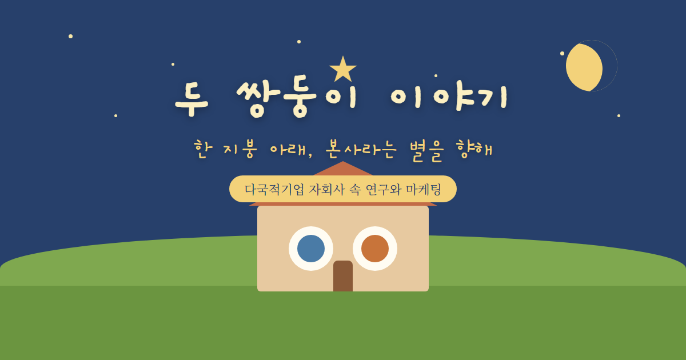

# 두 쌍둥이 이야기 🌟

> 한 지붕 아래, 본사라는 별을 향해 — 다국적기업 자회사 속 **연구(R&D)와 마케팅**, 두 기능의 비밀을 풀어낸 그림 동화.

어느 학술 논문(MNC 자회사의 지식이전·현지 착근·자율성 연구)을 어린이 그림 동화책으로 다정하게 각색한 인터랙티브 페이지입니다.

## 📖 보러 가기

GitHub Pages에서 바로 읽어보세요 → **https://sdkparkforbi.github.io/mnc-twins-storybook/**

## 🧩 이야기 속에 담긴 연구

| 동화 속 비유 | 실제 연구 개념 |
|---|---|
| 두 쌍둥이 (연구·마케팅) | 자회사 내 R&D·마케팅 **기능별 이질성** |
| 본사라는 별 | 본사–자회사(HQ–subsidiary) 관계 |
| 정보의 끈 | 본사 정보 의존도 |
| 동네 친구 (기술자 vs 손님) | 현지 착근(locally-supported vs locally-specific) |
| 심부름꾼 / 함께 모여 | 지식이전 메커니즘 (주재원 vs working group·파견) |
| 자유의 두 모양 | 자율성의 두 차원 (현지 전략 vs 자원) |
| 주고받기 | give-and-take 거버넌스 |

데이터: ICT·자동차 산업 **26개 MNC 자회사**, 직원 **558명** 설문 + 관리자 **35명** 인터뷰.

## 🛠 구성

- `index.html` — 동화책 본문 (스크롤형, 자체완결 HTML)
- `thumbnail.png` / `thumbnail.html` — 공유용 썸네일 (1200×630)

---
*This is a whimsical storybook adaptation for outreach. 미게재 원고의 핵심 발견을 비유로 옮긴 것으로, 수식·표·전체 본문은 포함하지 않습니다.*
